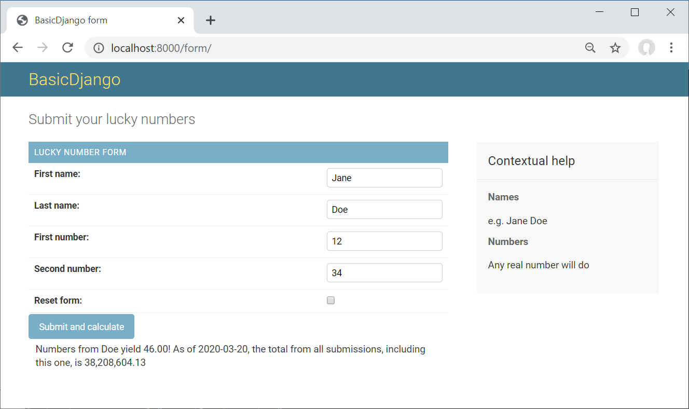

# Quick and dirty Python|Django (for data scientists)

The idea here is to have a template like minimum working example for Django in order to quickly get going with a simple (prototype) front-end.

This project (so far) includes
* a simple input form (data input),
* basic CSS styling,
* result output,

and should look like this:




## Requirements:
* Python 3+ environment (I use Conda) with Django 2.2+. If you use Conda, you can create the environment from django.yaml (included).
```
conda env create -f django.yml
```


## Quick start:
1. Activate your django environment
```
conda activate django
```
2. Migrate data base (SQLite by default, see below how to use PostgreSQL)
```
python manage.py migrate
```
3. Create superuser (you could skip this step)
```
python manage.py createsuperuser --username=admin --email=email@domain.com
```
4. Run server
```
python manage.py runserver
```
The console should show something like:
```
Watching for file changes with StatReloader
Performing system checks...
System check identified no issues (0 silenced).
January 06, 2020 - 13:28:11
Django version 2.2.5, using settings 'firstdjango.settings'
Starting development server at http://127.0.0.1:8000/
Quit the server with CTRL-BREAK.
```
5. Try out the form and admin area (login with your superuser)
```
http://127.0.0.1:8000/form
http://127.0.0.1:8000/admin
```

# More fun with Django
A proper and very well written tutorial is available at: https://docs.djangoproject.com/en/3.0/intro/tutorial01/


## MTV (Model Template View) design priciple:
* Model: data access layer
* Template: presentation layer
* View: bridge between model and template


## Create NEW project
1. Open console at project location (new project folder will be created here)
2. Initiate the project
```
django-admin startproject basicdjango
```
This will create a project folder including manage.py, which is a wrapper for django admin commands specific to this project. Apps have to be intergated into:
* settings.py (holds secret key (!) ... do not version)
* urls.py (routing within project/site)


## Apps
Each project (e.g. basicdjango) can contain multiple apps (e.g. blog, store). In this example, "form" is an app.
```
python manage.py startapp form
```

### Forms
In this example we define a form class in ``form/forms.py``. More information at:
* https://docs.djangoproject.com/en/2.2/topics/forms/
* https://docs.djangoproject.com/en/2.2/ref/forms/fields/
In ``form/views.py`` we then render the form via 
```python
render(request, 'form.html', {'form': form})
```


## Migrate to PostgreSQL
1. Change DATABASES in basicdjango/settings.py:
```python
DATABASES = {
    'default': {
        'ENGINE': 'django.db.backends.postgresql',
        'NAME': 'firstdjango',
        'USER': 'postgres',
        'PASSWORD': 'password',
        'HOST': 'localhost',
        'PORT': '5432'
    }
}
```
2. Make sure the package ``psycopg2`` is installed in your (conda) environment
3. Migrate to the new database
```
python manage.py migrate 
```


## Migrate an app
1. Create migrations
```
python manage.py makemigrations form
```
2. Check SQL code (optional)
```
python manage.py sqlmigrate form 0001
```
3. Migrate
```
python manage.py migrate
```


